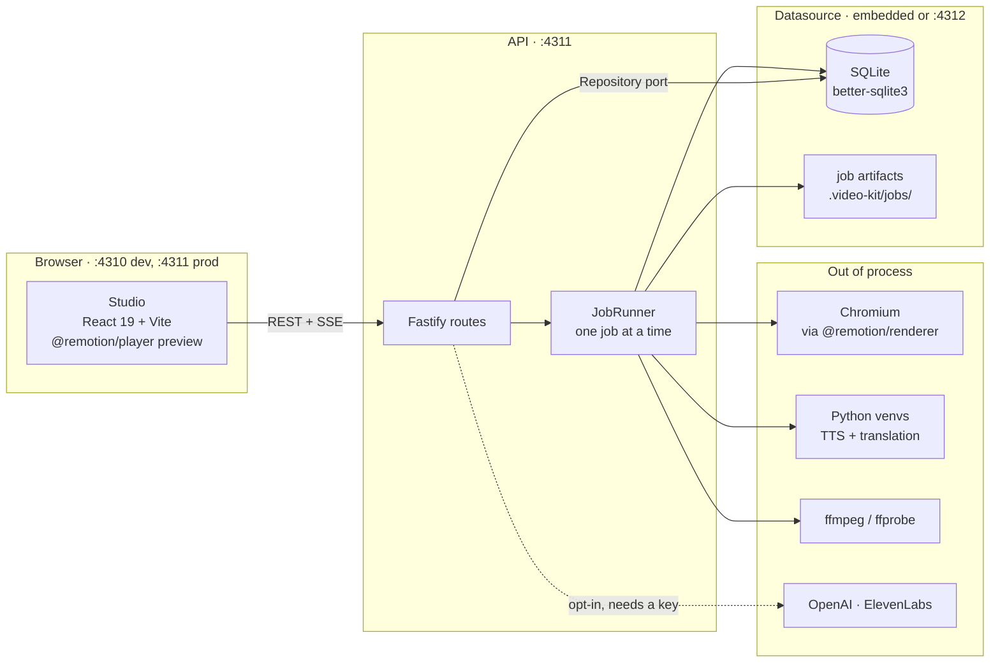
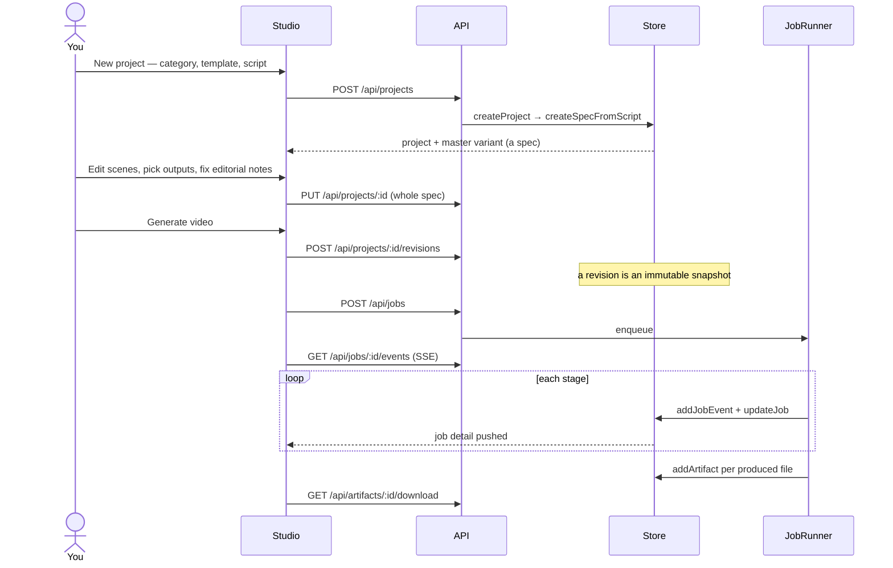
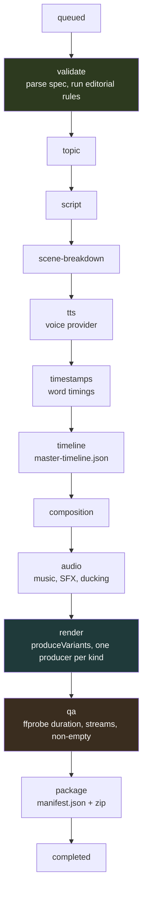
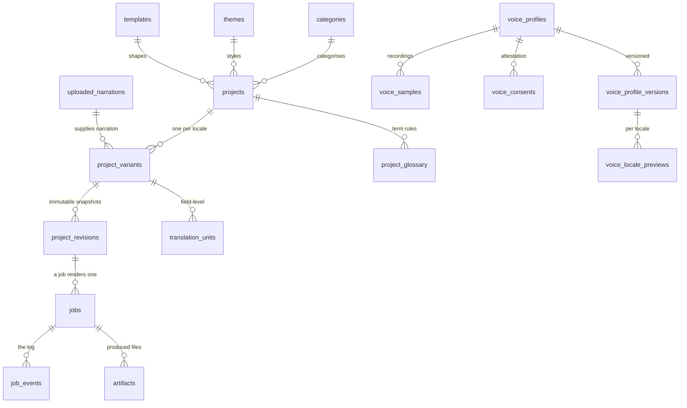

# Operating the kit

How the thing runs, what it depends on, and where to look when it breaks.
[`extending.md`](./extending.md) covers adding new things; this covers running
and fixing what is already there.

## The sixty-second version

You write (or generate) a script. The studio turns it into a **spec** — a video
described as data, not as React. A **job** takes an immutable snapshot of that
spec through fourteen stages: narration is synthesized, timings are extracted,
a master timeline is built, Remotion renders every requested **output variant**,
QA probes the files, and everything is zipped.

Three long-lived pieces, and none of them has to run in the same process:



The **Repository port** is the seam that matters: `Repository` is
`MaybeAsync<StudioRepository>`, satisfied both by the embedded SQLite adapter
and by an HTTP client. `VIDEO_KIT_DATASOURCE=embedded` (the default) runs the
store inside the API; a URL points it at `npm run datasource` instead. A
contract test runs the same assertions against both.

## Running it

```bash
npm ci                 # one install at the root links every package
npm run db:migrate     # apply migrations deliberately

npm run app            # API on :4311, serving the built studio
npm run app:dev        # API + studio with hot reload (studio on :4310)
npm run app:dev:all    # datasource + API + studio, three processes
npm run datasource     # the store alone on :4312
```

In dev the studio runs on **:4310** and proxies `/api` to **:4311**. In
`npm run app` there is no :4310 — Fastify serves the built bundle from
`packages/frontend/dist`, so **run `npm run app:build` first** or you will get a
404 at the root while `/api/health` answers fine.

No package has a build step. Everything ships TypeScript source and runs under
`tsx`. That is why `node some-script.ts` fails where `tsx some-script.ts` works.

### Working from the command line instead

```bash
npm run new -- --channel tech "My video title"   # scaffold a spec
npm run validate -- tech/my-video                # editorial rules
npm run render -- tech/my-video                  # render its default outputs
npm run render -- tech/my-video --variant loop-gif
npm run studio                                   # Remotion Studio
```

## What it is built on

| Layer | Choice | Version | Why it is here |
| --- | --- | --- | --- |
| Rendering | Remotion | 4.0.501 | Video as React. `@remotion/bundler` + `@remotion/renderer` in the engine, `@remotion/player` in the studio |
| API | Fastify | ^5.5 | Plus `@fastify/static` for `public/` and the studio bundle, `@fastify/multipart` for uploads |
| Store | better-sqlite3 | ^12.2 | Synchronous, single file, no server. The async port is what lets it move out of process later |
| Contracts | zod | ^4.1 | Every scene type, the spec envelope, and every request body. TS types are *derived* from the schemas |
| Studio | React 19 + Vite 7 | — | Hash routing, no router library, no state library |
| Language | TypeScript 5.6 under tsx | — | `tsc --noEmit` only; nothing emits |
| Media | ffmpeg / ffprobe | system | Concat, loudnorm, and QA probing. Falls back to the ffprobe inside Remotion's compositor package when absent from `PATH` |
| Python | 3.x in three venvs | — | Local TTS and translation models |

Boundaries are enforced by `npm run deps:check`, not by convention: it checks
that every cross-package import is declared in that package's `package.json`,
that `core` imports no other package, and that nothing reachable from `core`'s
isomorphic entry touches `node:`. CI runs it.

## The user flow



A **revision** is why an edit mid-render cannot corrupt a job: the job holds a
snapshot, not a live pointer.

Studio routes are hash-based — `#/`, `#/new`, `#/projects/:id`, `#/jobs`,
`#/library`, `#/voices`, `#/legacy`.

## The job pipeline

A production job passes through **fourteen** stages, in this order — taken
from a real completed job, not from the type:



`JobStageSchema` (`packages/core/src/contracts.ts`) holds eighteen values, not
fourteen, and the difference trips people up. Two belong to the other job
kinds — `translation` and `voice-validation` — and two more, `captions` and
`voice`, are **legacy aliases** that no longer occur; `canonicalProductionStage`
in `packages/core/src/pipeline.ts` maps them onto current stages so old rows
still render. `PRODUCTION_PIPELINE` in the same file is a third list again: the
ten-item grouping the UI displays, which folds `queued`/`validate` into *Topic*
and `package`/`completed` into *QA*. If you are matching on stage names, decide
which of the three you mean.

`status` is one of `queued · running · completed · failed · cancelled ·
interrupted`. On a throw the runner marks the job `failed`, records the message
on the row, and emits it as an `error` job event at whatever stage was current
— so **the last event in the log is the failure**.

Editorial issues are emitted as `warn` events and **never fail a job**. That is
a measurement, not a preference: see the note at the end of `extending.md`.

## Where the models are integrated

Everything local runs as a **subprocess** the API spawns and talks to over
stdio — no model runs in the Node process. Cloud providers are opt-in and
inert without a key.

| Model | What for | Where it runs | Needs | Absent → |
| --- | --- | --- | --- | --- |
| **Kokoro-82M** (`mlx-community/Kokoro-82M-bf16`) | Default narration | Local, `.venv-tts`, via `mlx_audio` | `npm run voice:setup` | TTS stage fails |
| **Chatterbox** | "My Voice" cloned English | Local, `.venv-local-voice` | A ready voice profile | `createJob` rejects the job |
| **IndicTrans2** (`ai4bharat/indictrans2-{en-indic,indic-en}-1B`) | Translation for localized variants | Local, `.venv-indic`, via `transformers` | `npm run ai:setup` | Translation jobs fail |
| **IndicF5** (`ai4bharat/IndicF5`) | Indic-language narration | Local, `.venv-indic` | `npm run ai:setup` | *Currently disabled* — see below |
| **OpenAI** (`OPENAI_SCRIPT_MODEL`, default `gpt-5.6-sol`) | AI script generation | Cloud | `OPENAI_API_KEY` | Feature reports unconfigured; the studio still works, you paste a script |
| **ElevenLabs** (`eleven_multilingual_v2`) | Cloud TTS | Cloud | `ELEVENLABS_API_KEY` | *Currently disabled* — see below |

Two of those are registered but **unreachable**, and the distinction matters
when you are debugging why a provider "does nothing":

> `createJob` (`packages/datasource/src/sqlite/repository.ts`) rejects
> `f5tts`, `indicf5` and `elevenlabs` outright — *"Cloned voice production is
> disabled. Use local Studio TTS or upload a complete narration track."* The
> provider modules exist and are wired into `VOICE_PROVIDERS`, but no job can
> request them. Registering a provider is not the same as enabling one.

Adding a provider is a module in `packages/backend/src/jobs/voice/` plus one
registry entry — the runner asks `voiceProviderFor(id)` rather than branching.
The two shapes are *per-scene* (synthesize each scene, then pad → concat →
loudnorm) and *whole-track* (Kokoro reads the whole SRT in one pass; `uploaded`
takes a file you supply).

Kokoro's output is cached under `.cache/video-kit/studio-audio/`, keyed on a
hash of the SRT, the spoken text, the voice settings and the locale. **A voice
change that does not change any of those will reuse the cached track.**

## API surface

All under `/api`. `GET /api/health` is the liveness check.

| Area | Routes |
| --- | --- |
| Catalog | `GET /catalog` · `GET /languages` · `POST/PUT /themes` `/templates` `/categories` |
| Projects | `GET/POST /projects` · `GET/PUT /projects/:id` · `POST /projects/:id/revisions` · `POST /projects/:id/import-script` · `POST /projects/:id/images` |
| Variants | `GET/POST /projects/:id/variants` · `PUT /projects/:id/variants/:variantId` · `POST .../promote` |
| Glossary | `GET/POST /projects/:id/glossary` · `DELETE /projects/:id/glossary/:entryId` |
| Jobs | `GET/POST /jobs` · `GET /jobs/:id` · `GET /jobs/:id/events` *(SSE)* · `POST /jobs/:id/cancel` `/retry` |
| Artifacts | `GET /artifacts/:id/download` |
| Voices | `GET/POST /voices` · `GET /voices/:id` · `POST /voices/:id/samples` `/revoke` · `DELETE /voices/:id` |
| Narrations | `GET/POST /narrations` · `GET /narrations/:id/audio` |
| Script gen | `GET /script-generation/status` · `POST /script-generation/generate` |
| Legacy | `GET /legacy-videos` · `POST /legacy-videos/:channel/:slug/clone` |
| Music | `GET /music` · `GET /music/:id/audio` |

Bodies are zod-parsed at the route, so a 400 names the offending field. The
same schemas are the TypeScript types — there is no second declaration to drift.

## Database

SQLite at `.video-kit/video-kit.db` (`VIDEO_KIT_DB_PATH`). Migrations are
plain SQL in `packages/datasource/migrations/`, applied in filename order and
recorded in `schema_migrations`.



Things worth knowing before you go poking:

- **`project_variants.spec_json` is re-parsed on every read.** Tightening a
  scene schema can make a stored project unreadable. `npm run db:check-specs`
  reports which and why; `npm run db:repair-specs` drops fields the schema no
  longer recognises and reports what needs a human.
- **`project_revisions.snapshot_json`** holds the whole spec *plus* the
  resolved channel, theme and template. A job reads the snapshot, never the
  live project.
- **`artifacts.path` is a filesystem path**, and `artifacts.delivery_id` is
  free text, not an enum — which is why adding output variants needed no
  migration.
- **Themes, templates and categories are versioned**; `active_version_id`
  points at the live one. Categories are the exception — one row, whole
  definition in `definition_json`.
- `npm run db:check-editorial` reports what the editorial rules say about every
  stored project.

## Debugging

### Where state lives

```
.video-kit/video-kit.db        the database
.video-kit/jobs/<id>/          artifacts + renders for one job
.video-kit/models/             downloaded model weights
.cache/video-kit/              memoised Remotion bundle, cached TTS audio
public/generated/<job>/        per-job generated audio and captions
packages/frontend/dist/        the built studio (served by npm run app)
out/                           CLI render output
```

Deleting `.video-kit/` resets everything including your projects. Deleting
`.cache/video-kit/` is always safe — it only costs time.

### First moves

```bash
curl -s localhost:4311/api/health              # is the API up
npm run typecheck && npm run deps:check        # is the tree sane
npm test                                       # 184 tests, ~5s
npm run db:check-specs                         # is stored data still readable
curl -sN localhost:4311/api/jobs/<id>/events   # watch a job live
```

A failed job carries its message on the `jobs` row and as the final `error`
event. Read it rather than guessing — `GET /api/jobs/:id` returns the row,
every event and every artifact in one payload:

```bash
curl -s localhost:4311/api/jobs/<id> | python3 -m json.tool | tail -40
```

With the API down, go at the database directly. There is no `sqlite3` CLI
dependency in this repo, so use the driver that is already installed:

```bash
npx tsx -e "
import Database from 'better-sqlite3';
const db = new Database('.video-kit/video-kit.db', {readonly: true});
for (const r of db.prepare(
  'SELECT stage, level, message FROM job_events WHERE job_id=? ORDER BY id DESC LIMIT 10'
).all(process.argv[1])) console.log(r.level, r.stage, '·', r.message);
" <job-id>
```

### Symptoms

| What you see | Almost always | Fix |
| --- | --- | --- |
| `ERR_MODULE_NOT_FOUND` on a relative import | Ran a `.ts` file with `node` | Use `tsx`. Every entry point does |
| 404 at `/` but `/api/health` is fine | No built studio bundle | `npm run app:build`, or use `npm run app:dev` |
| Render fails downloading Chromium | Sandbox or offline; Remotion fetches its own browser | Point `REMOTION_BROWSER_EXECUTABLE` at an existing Chromium |
| `Old Headless mode has been removed` | That Chromium does not support Remotion's default mode | Use a `headless_shell` binary, or set `REMOTION_CHROME_MODE` |
| `Generated artifact is empty: …` | QA caught a zero-byte file — the producer failed quietly | Check the `render` events just above it |
| QA fails on duration | Narration retimed the video away from the spec | Compare `master-timeline.json` against the spec's frame counts |
| `ffprobe` not found | No system ffmpeg | Already falls back to Remotion's bundled ffprobe; install ffmpeg if that path is missing too |
| TTS stage fails immediately | Python venv missing or wrong interpreter | `npm run voice:setup`; override with `TTS_PYTHON` |
| Voice change had no effect | Kokoro reused its cache | Change the script/voice settings, or clear `.cache/video-kit/studio-audio/` |
| "Cloned voice production is disabled" | `createJob` gates `f5tts`/`indicf5`/`elevenlabs` | Use `kokoro`, `chatterbox` with a ready profile, or upload a track |
| AI script generation unavailable | No `OPENAI_API_KEY` | Set it in `.env`, restart the API. Or paste a script |
| Stored project will not open | A schema tightened under existing data | `npm run db:check-specs`, then `db:repair-specs` |
| Editorial warnings you cannot clear | Some are advisory by design | `npm run db:check-editorial` shows all of them with severity |
| Studio builds but a page is blank | Usually a `node:` import reaching the browser bundle | `npm run deps:check` catches this for `core` |
| Jobs queue but never start | The runner processes one at a time | Check for a `running` job; `POST /api/jobs/:id/cancel` |

### Reading a job end to end

Each artifact row in that payload carries `kind`, `filename`, `sizeBytes` and
`checksum`, so "did it actually produce anything, and was it empty" is
answerable without touching the disk. Use the SSE stream only for a job that is
still running.

### Environment

`.env` at the workspace root, loaded once by `@video-kit/core/config` for every
process. See `.env.example`; the ones that matter most when debugging:

| Variable | Default | Effect |
| --- | --- | --- |
| `VIDEO_KIT_PORT` / `VIDEO_KIT_WEB_PORT` / `VIDEO_KIT_DATA_PORT` | 4311 / 4310 / 4312 | Ports. API and web must differ |
| `VIDEO_KIT_DB_PATH` | `.video-kit/video-kit.db` | Point at a scratch copy to experiment safely |
| `VIDEO_KIT_DATASOURCE` | `embedded` | Or a URL, to run the store out of process |
| `RENDER_CONCURRENCY` | Remotion's default | Lower it if renders exhaust memory |
| `REMOTION_BROWSER_EXECUTABLE` / `REMOTION_CHROME_MODE` | unset | Escape hatches when Remotion cannot get its own browser |
| `VIDEO_KIT_CACHE_DIR` | `.cache/video-kit` | Safe to delete at any time |
| `TTS_PYTHON` / `INDIC_AI_PYTHON` / `LOCAL_VOICE_PYTHON` | `.venv-*/bin/python3` | Which interpreter each model subprocess uses |

Never resolve paths from `process.cwd()` in new code — everything goes through
`@video-kit/core/config`, which is why the API works regardless of where it was
launched from.
